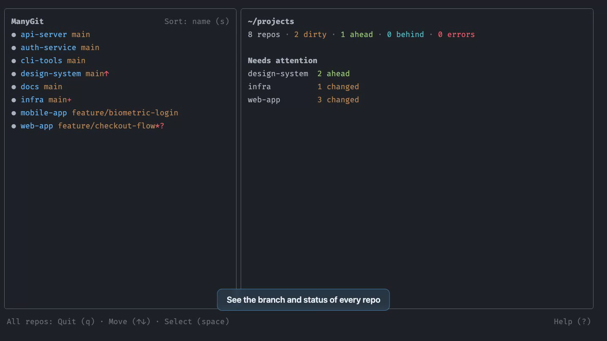

# manygit

manygit shows all the git repositories in a folder in one terminal screen. You can do git tasks on one repository or on many repositories at the same time.

[](assets/demo.mp4)

- See the branch and the status of each repository.
- Fetch, pull, push, and change branches in many repositories at the same time.
- Make commits, pull requests, and releases with text that AI writes. manygit uses [gityo](https://github.com/NazmusSayad/gityo) for this.

## Install

```bash
npm install -g manygit
```

## Start

To show the repositories in the current folder, type:

```bash
manygit
```

To show the repositories in a different folder, type the folder path:

```bash
manygit ~/code
```

## Select the repositories

An action applies to one of these:

- The repository at the cursor.
- The repositories that you select with `space`.
- All the repositories, when the cursor is not on a repository.

## Keys

| Key       | Action                                                     |
| --------- | ---------------------------------------------------------- |
| `enter`   | Make a commit. AI writes the commit message.               |
| `f`       | Get the new changes from the remote. Do not merge them.    |
| `p`       | Pull. This applies only if your branch has no new commits. |
| `P`       | Push. If the branch has no upstream, manygit sets it.      |
| `c`       | Change to a different branch.                              |
| `C`       | Make a new branch and change to it.                        |
| `X`       | Delete all the local branches, but not the current branch. |
| `o`       | Make or merge a pull request. AI writes the text.          |
| `R`       | Publish a GitHub release. AI writes the release notes.     |
| `w`       | Open the remote in the browser.                            |
| `r`       | Get the status again.                                      |
| `s`       | Change the sort order.                                     |
| `space`   | Select or clear the repository.                            |
| `↑` `↓`   | Move the cursor.                                           |
| `esc`     | Go back one step.                                          |
| `?` / `/` | Show all the commands.                                     |
| `q`       | Quit.                                                      |

Some actions can fail because of a problem that manygit can repair. For example, you have local changes, or the remote rejects a push. In these conditions, manygit shows the possible repairs, and you select one.

## AI features

Commits, pull requests, and releases use gityo and its configuration. Before you use these features, set up an AI model. Do the steps in the [gityo README](https://github.com/NazmusSayad/gityo#setup).

Pull requests and releases also need the [GitHub CLI](https://cli.github.com) (`gh`). You must sign in to `gh`.

## Saved settings

For each folder, manygit keeps these settings:

- The repositories that you selected.
- The sort order.
- The repository at the cursor when you quit.

manygit keeps these settings in `~/.manygit/state.json`. To use a different location, use `--store-dir <dir>`.
